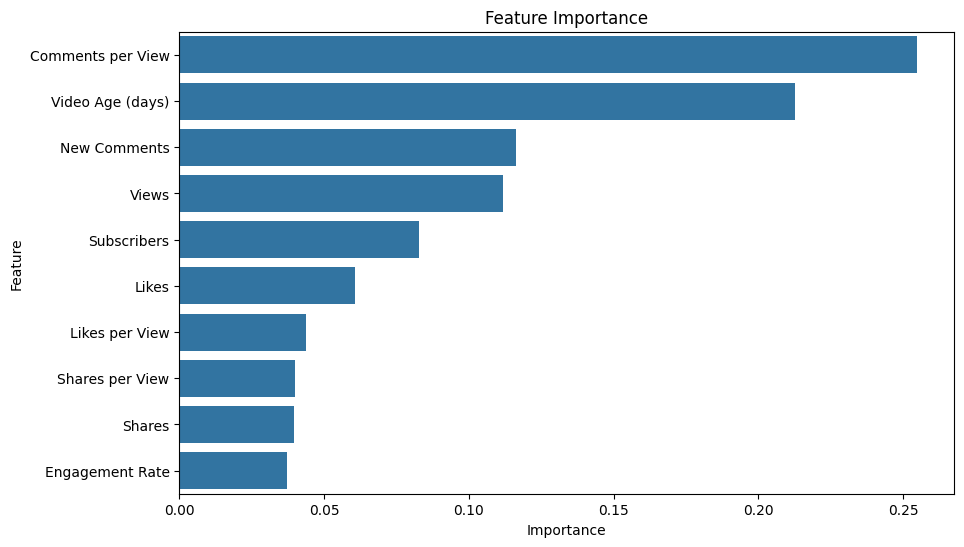
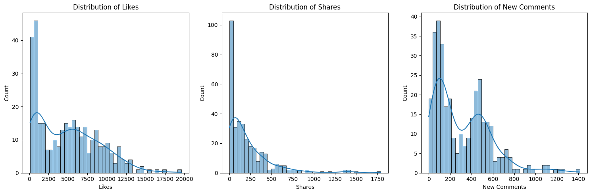
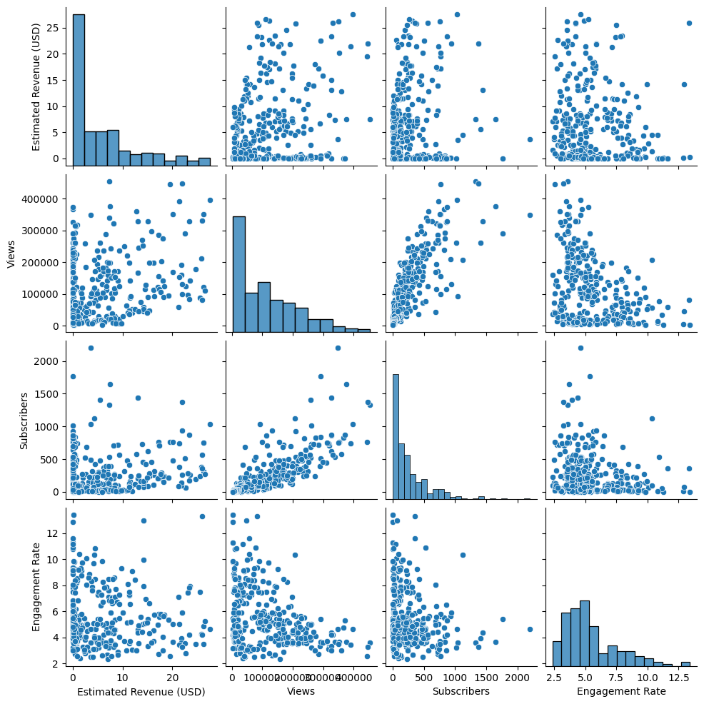
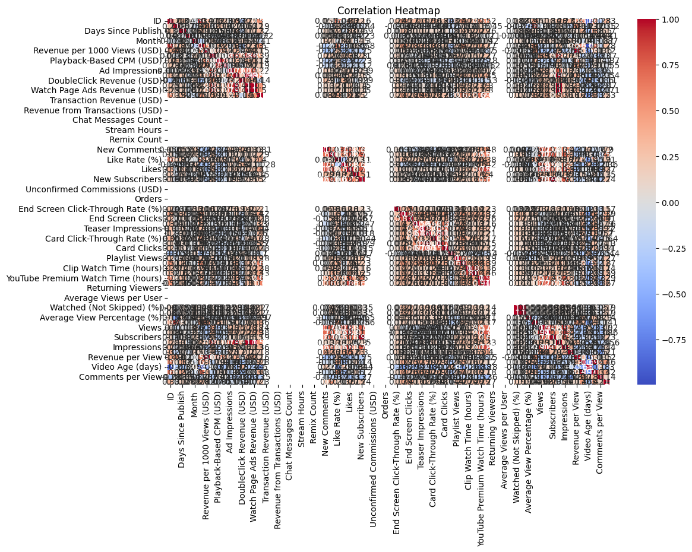
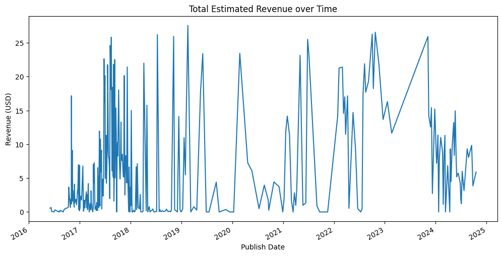

# YouTube Channel Performance Secrets Analysis

## Objective
Analyze real YouTube video analytics data to uncover key trends and revenue drivers. The project leverages data cleaning, exploratory data analysis (EDA), advanced feature engineering, machine learning modeling, and interactive visualizations to help content creators and marketers optimize their channel performance and maximize revenue.

## Project Overview
This project examines detailed YouTube metrics, including video performance, engagement, revenue sources, and audience behavior. Using Python, scikit-learn, Streamlit, and core data science libraries, we:
- Clean and process 70+ features from original channel-performance data.
- Explore relationships between engagement, growth, monetization, and audience trends.
- Apply and interpret a Random Forest regression model to predict estimated revenue.
- Deploy insights and interactive analytics via a web dashboard.

## Key Results and Visualizations

### Feature Importance for Revenue Prediction

- **Comments per View**, **Video Age (days)**, and **New Comments** are the strongest predictors of revenue.

### Engagement Metrics Distributions

- Likes, shares, and new comments are heavily right-skewed, indicating most videos receive a small number with a few viral outliers.

### Pairwise Relationships in Main Features

- Strong positive relationship between views and subscribers, as well as views and estimated revenue.
- Engagement rate and revenue have a weaker but notable link.

### Correlation Heatmap

- Highlights positive correlations between views, revenue, and related engagement variables.

### Revenue over Time

- Shows variation and trends in total channel revenue by video publish date, revealing key growth and monetization periods.

## Summary and Insights
- **Audience engagement** (especially comments per view) and maintaining active, recent uploads greatly impact revenue.
- The model identifies actionable priorities: foster audience interaction and post consistently.
- The Streamlit dashboard empowers channel owners and analysts to explore "what-if" scenarios, filter data, and predict revenue based on custom input.

## Technology Stack
- **Python** (pandas, numpy, seaborn, matplotlib, scikit-learn, joblib, shap, plotly)
- **Streamlit** (for web app/dashboard)
- **Jupyter Notebook** (for EDA and modeling workflow)

## Usage
1. Clone this repository.
2. Install requirements: pip install -r requirements.txt
3. Run and explore the Jupyter notebook for data analysis and model building.
4. Launch the Streamlit app via: streamlit run app.py

---

